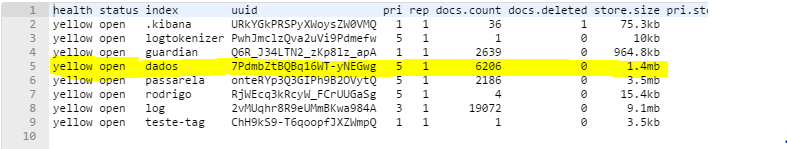
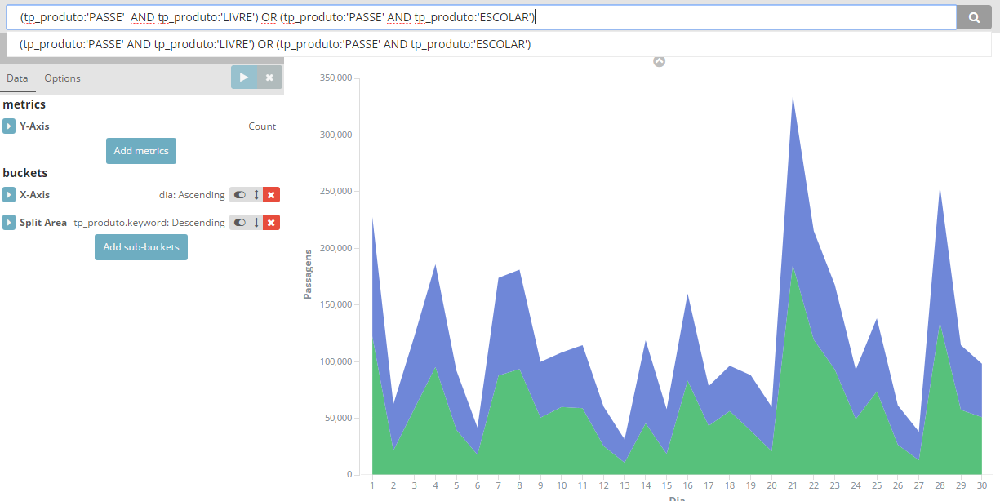

# ElasticSearch

1. [Uso com o Hive](#es-hive)

2. [Consulta e criação de índices](#cons-es)

3. [Aggregations & Filters](#es-filters)

Links úteis:

- [Hive & ElasticSearch Integration](https://www.elastic.co/guide/en/elasticsearch/hadoop/current/hive.html)  

  - [Configuração](https://www.elastic.co/guide/en/elasticsearch/hadoop/current/configuration.html)


- [ElasticSearch & Hadoop](https://www.elastic.co/blog/elasticsearch-and-hadoop)

--------------------------------------------------------------------------------

## []()Uso com o Hive

1. Baixe o _elasticsearch-hadoopX.X.X.jar_ no site: <https://www.elastic.co/downloads/hadoop>
2. Deixe disponível em um diretório tanto _"Local"_ quando no HDFS.
3. Através do HUE, vá _Query editor_ do Hive e coloque a linha, que colcoar a localização do Elastic Search para ser utilizado como _Storage Handler_ para o Hive **toda vez que for importar uma tabela**:

  ```sql
   ADD JAR hdfs:///user/rodrigo/es-hadoop/elasticsearch-hadoop-5.4.0.jar
   ADD JAR /usr/hdp/current/hive-client/lib/commons-httpclient-3.0.1.jar;
  ```

4. Crie uma tabela externa com as configurações da tabela que você deseja exportar:

```sql
create external table pop_area_es (
coduf int,
uf string,
nomemun string,
area double,
pop int,
pessoa_por_km double
)
comment 'Join de duas tabelas, area e pop'
row format delimited
fields terminated by ','
lines terminated by '\n'
stored by 'org.elasticsearch.hadoop.hive.EsStorageHandler'
TBLPROPERTIES('es.resource' = 'dados/ibge',
          'es.nodes' = '10.100.2.32:9200,10.100.2.33:9200');
--a linha acima, TBLPROPERTIES, retém a configuração que você deseja passar para o ElasticSearch

insert overwrite table rodrigo.pop_area_es
select a.* from rodrigo.pop_area a
--Esta linha insere os valores numa tabela externa.
```

Da mesma forma para a tabela SITPASS:

[/\ Configuração /\](https://www.elastic.co/guide/en/elasticsearch/hadoop/current/configuration.html)

--------------------------------------------------------------------------------

## []() Consulta e criação de índices.

A linha acima já gerou um _índice_ e um _type_ na linha `'es.resource' = '<índice/type>'`, então neste caso não é necessário criar o índice. Nesse caso _index_ = dados, _type_ = ibge.

Após isso você poderá ver o índice criado na lista de índices do ElasticSearch:

> <http://hdp11.discover.com.br:9200/_cat/indices?v>



--------------------------------------------------------------------------------

## []() Aggregations & Filters

[Consultar este link (Aggregations)](https://www.elastic.co/guide/en/elasticsearch/reference/current/search-aggregations.html)

>'Aggregations' é o termo usado para a 'Busca Facetada'

[Este aqui para filtros](https://www.elastic.co/guide/en/elasticsearch/reference/current/_executing_filters.html)

Para fazer a seleção, no caso SITPASS, das passagens que são subsidiadas (Passe livre e escolar), usei a seguinte requisição GET:
```JSON
{

	"query":{

		"bool": {

			"must":{
				"match":{"tp_produto":"PASSE"}
			},
			"must_not":{
				"match":{"tp_produto":"COMUM"}
			},
			"should":[
				{"match":{"tp_produto":"LIVRE"}},
				{"match":{"tp_produto":"ESCOLAR"}}
			]

		}

	}

}
```

Isso acima gera o mesmo resultado que o filtro disponível no Kibana:  

```
(tp_produto:'PASSE'  AND tp_produto:'LIVRE') OR (tp_produto:'PASSE' AND tp_produto:'ESCOLAR')
```



Que está disponível no aqui:

[DASHBOARD SITPASS](http://hdp10.discover.com.br:5601/app/kibana#/dashboard/SitPass?_g=(filters%3A!()))
