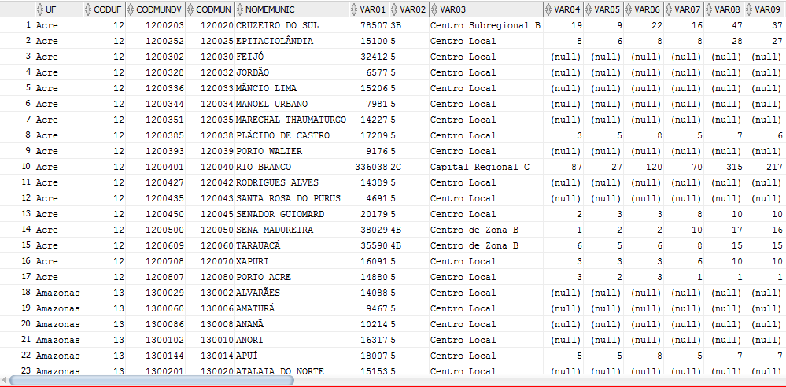

# <a name='export-sqoop'></a>Export de dados para uma tabela no DB Oracle

Primeiro seleciona-se a tabela da qual você deseja exportar os dados:  
```sql
insert overwrite directory '/user/rodrigo/import_ibge/dados_ibge.csv'
row format delimited
fields terminated by ','
lines terminated by '\n'
select * from rodrigo.dados_municipios_orc
```

Isso gera um diretório com os arquivos no formato solicitado, incluindo as linhas com os nomes das colunas.  
Agora é necessário o comando do Sqoop para fazer o _import_:

```bash
SQOOP EXPORT --connect "jdbc:oracle:thin:@10.100.0.150:1521:somos" --username SITPASS --password-file '/user/rodrigo/sqoop.password' --table SITPASS.IBGE --input-fields-terminated-by ',' --input-lines-terminated-by '\n' --export-dir "/user/rodrigo/import_ibge/dados_ibge.csv" --input-null-string "\\\\N" --input-null-non-string "\\\\N" --verbose 2>&1|tee export_ibge.log
```  
>Esse comando gerou um erro, __ORA-00942__, devido ao fato de não ter uma tabela com o mesmo nome que o informado.  
>Para corrigir você deve criar uma tabela previamente no Oracle.



Você também pode salvar o arquivo e utilizar a ferramenta de importação do Oracle.
