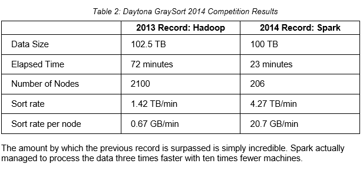

# Apache Spark

Introdução sobre o Spark:

É um sistema de computação escalável voltado para Big Data, com um funcionamento diferente do Hadoop e maior poder computacional se comparado com o Hadoop.
>The next very important thing happened in November 2014. Spark won the Daytona GraySort contest. Daytona GraySort is a competition where various companies come to show off their big data processing frameworks and solutions. The basic goal is to sort 100 terabytes of data (consisting of one trillion records) as fast as possible. The data that needs to be sorted is located on the HDFS, the inner workings of which we described in the previous section. Sorting the data usually takes around 500 TB of disk I/O and around 200 TB of network I/O. Organizations from around the world often build dedicated sort machines with specialized hardware and software. Winning the 2014 sort competition is a very important milestone for the Spark project, especially when the previous world record set by Yahoo with Hadoop MapReduce is taken into account:   

  

Os componentes são o ___Core___, ___SparkSQL___, ___Streaming___, ___MLib___ e ___GraphX___:
- __Core:__  
  Gestão de memória, enfileiramento de tarefas, recuperação de erros e interação com os sistemas de armazenamento.  

- __SparkSQL:__  
  É um _package_ para trabalhar com data estruturada. Prioritariamente foi feito para trabalhar com o _Hive Query Language_ mas atualmente suporta trabalhar com várias formas de DataSets, como JSON, através de uma sintaxe similar ao SQL.

- __Streaming:__  
  É um _package_ feito para lidar com fluxo de dados em tempo real (uma grande vantagem comparado ao Hadoop), podendo gerar resultados de processamento de dados _on-the-fly_.

- __MLib:__  
  Provém funcionalidades de _Machine Learning_ através de uma coleção de algorítmos de alto nível.

- __GrahpX:__  
  Biblioteca para manipulação de dados em Grafos.

## Usando o Spark:

Você pode selecionar, na instalação, as distribuições que usarão as linguagens _R_, _Python_, _Scala_ e _Java_. Nestes exemplos usarei _Python_.  

Você pode rodar programas através do Shell (que já inicializa as variáveis de contexto, SparkContext) ou através de um código gerado em um editor e pode rodar através de `submit-spark`.

O Spark utiliza um conceito chave: ___RDD___, _Resilient Distributed Dataset_. <https://spark.apache.org/docs/1.6.2/api/java/org/apache/spark/rdd/RDD.html>

Você pode encontrar uma boa explicação do básico do Spark no link:  
>https://www.dataquest.io/blog/apache-spark/

### Exemplos:

Fazer a abertura de um arquivo e contar as palavras repetidas desse arquivo (que está no HDFS do ambiente Hadoop):  
```python
dados = sc.textFile("hdfs://hdp9.discover.com.br:8020/user/rodrigo/Dados-IBGE/*") # Carrega arquivo do HDFS em um RDD
dados.count() #Conta o número de linhas

contador = dados.flatMap(lambda line: line.split(';'))\
            .map(lambda palavra: (palavra,1))\
            .reduceByKey(lambda a,b: a+b)

contador.takeOrdered(100, key=lambda x: -x[1])
```

Para __filtrar__ os dados:
```python
#importar os módulos necessários para criar um objeto

from pyspark.sql import Row, Column, DataFrame, DataFrameNaFunctions
from pyspark.sql.types import StructType
from pyspark.sql.types import StructField
from pyspark.sql.types import IntegerType
from pyspark.sql.types import StringType
from pyspark.sql.types import FloatType

#setar os valores do RDD
dados = sc.textFile("hdfs://hdp9.discover.com.br:8020/user/rodrigo/Dados-IBGE/*")

#quebra as linhas
linhas = dados.map(lambda linha: linha.split(";"))

#Crio uma 'ROW' do sqlContext
objeto = linhas.map(lambda campo: Row(num_linha=int(campo[0]), cod_regiao=int(campo[1]), estado=str(campo[2].encode('utf-8').strip()), uf=str(campo[3].encode('utf-8').strip()), cod=int(campo[4]), cidade=str(campo[5].encode('utf-8').strip()), area=float(campo[6])))

#Agora eu crio uma função para filtrar

def filtrar(a):
  return (a["uf"] == "SP")

#Passo para uma variável:
dados_filtrados = objetos_linhas.filter(filtrar)

#Agora o retorno dela é:
# >> 645 [Correto!]
```

Também podemos usar o SparkSQL para aproveitar de uma forma mais simples para fazer a filtragem:

```python

#Cria a definição do schema
fields = [StructField("num_linha", IntegerType(), True), \
          StructField("cod_regiao", IntegerType(), True), \
          StructField("estado", StringType(), True), \
          StructField("uf", StringType(), True),
          StructField("cod", IntegerType(), True),
          StructField("cidade", StringType(), True),
          StructField("area", FloatType(), True) ]


#Cria um schema
schemaIBGE = StructType(fields)

#cria um data frame:
df = sqlContext.createDataFrame(objeto, schemaIBGE)

#cria uma table no contexto sql usando o dataframe df
sqlContext.registerDataFrameAsTable(df, "dados_ibge")

#retorna a seleção
query = sqlContext.sql("select * from dados_ibge")
```
>Desta forma __CUIDADO__ ao colocar os valores. O 'objeto' que foi criado lá em cima retorna de forma ordenada por ordem alfabética. Logo, quando definimos o Schema através do _fields_ e _StruckType_, ele não irá alocar corretamente os valores mesmo que tenham o mesmo nome de coluna. Então decida por um __OU__ por outro.  

Você pode registar o DataFrame diretamente para evitar o erro acima [Sem registrar um Schema!]:    

```python
df = sqlContext.createDataFrame(objeto)
sqlContext.registerDataFrameAsTable(df, "dados_ibge")
query = sqlContext.sql("select * from dados_ibge")

#Query me permite fazer as operações comuns de um RDD:

ufs = query.map(lambda x: x.uf)
total = ufs.map(lambda a: (a,1)).reduceByKey(lambda a,b: a+b)
```
Aqui, total retorna a quantidade de linhas por UF, pois a função `.map(lambda x: (x,1))` cria uma tupla, por exemplo `("SP", 1)`, repetidas vezes, que a função `reduceByKey(lambda x,y = x+1)` combina as chaves que tem o mesmo valor.  
O retorno foi:

>[(u'PR', 399), (u'AC', 22), (u'MA', 217), (u'RR', 15), (u'DF', 1), (u'AM', 62), (u'MG', 853), (u'CE', 184), (u'PB', 223), (u'GO', 246), (u'ES', 78), (u'MS', 79), (u'SC', 295), (u'RN', 167), (u'RJ', 92), (u'SE', 75), (u'RO', 52), (u'BA', 417), (u'AP', 16), (u'RS', 499), (u'AL', 102), (u'TO', 139), (u'PA', 144), (u'SP', 645), (u'PE', 185), (u'MT', 141), (u'PI', 224)]  

Para _ordenar pelo valor_, podemos usar ´total.takeOrdered(total.count(), lambda x: -x[1])´, listando assim o estado mais cidades primeiramente.

>Sort by keys (ascending):  
RDD.takeOrdered(5, key = lambda x: x[0])  
Sort by keys (descending):  
RDD.takeOrdered(5, key = lambda x: -x[0])  
Sort by values (ascending):  
RDD.takeOrdered(5, key = lambda x: x[1])  
Sort by values (descending):  
RDD.takeOrdered(5, key = lambda x: -x[1])    

Para salvar em um _arquivo de texto_ o que encontramos temos:
```python
arquivo = total.map(lambda a: str(a[0]) + "|" + str(a[1]) + "\n")
arquivo.saveAsTextFile("hdfs://hdp9.discover.com.br:8020/user/discover/teste")

#Podemos salvar o DataFrame acima ('df') no formato JSON:
df.toJSON().saveAsTextFile("hdfs://hdp9.discover.com.br:8020/user/discover/teste")
```

O guia completo está aqui:  
<https://spark.apache.org/docs/1.6.0/sql-programming-guide.html#overview>
