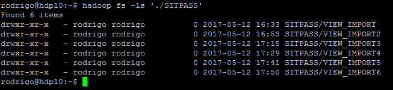
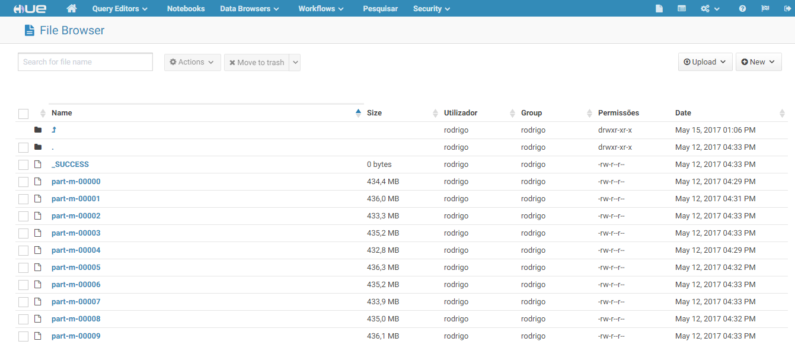
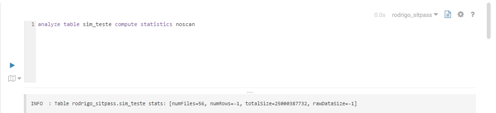
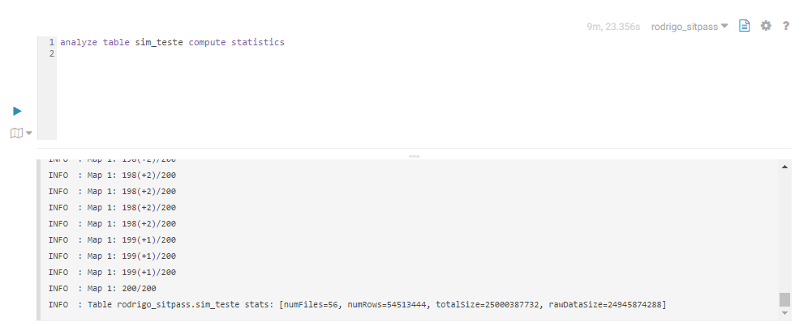
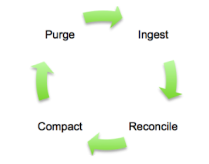

# Importação de Dados para o HDFS atrvés do Sqoop:

1.1. [Import Incremental](#import-incr)

>O _'export'_ de dados foi mais simples e está [aqui](./Arquivos/sqoop/export.md)

Tentativa de um import direto, salvando no HDFS diretamente num arquivo de texto através do comando abaixo:  
```bash
sqoop import --connect jdbc:oracle:thin:<dados_de_acesso> --username <user>  -P --table SIM_DETALHE_INFORMACAO --m 1 --target-dir -- /user/rodrigo/<dir_> --verbose >> log.txt
```
> Neste caso, como não havia uma _primary key_ na tabela-origem, não era possível setar o número de mappers para maior do que 1. Deixei rodando por cerca de 50 minutos e não tive nenhum resultado. Observe que a velocidade foi baixíssima: (0,112 Mbytes/seg);

Na segunda tentativa eu criei uma tabela menor na base do Oracle apenas para teste:

```sql
Create table teste as select * from SIM_DETALHE_INFORMACAO where ROWNUM < 10
```
Tive o erro: ___ERROR manager.SqlManager: Error executing statement: java.sql.SQLRecoverableException: Exceção de E/S: Connection reset___.  

Resolvi através do comando direto no terminal Linux:
```bash
export HADOOP_OPTS=-Djava.security.egd=file:/dev/../dev/urandom
```
Referências: [Pythian](https://www.pythian.com/blog/connection-resets-when-importing-from-oracle-with-sqoop/) e [StackOverFlow](http://stackoverflow.com/questions/2327220/oracle-jdbc-intermittent-connection-issue) com a explicação dos porquês.

Tornou-se evidente que era necessário dividir a tarefa para aproveitar o processamento do cluster Hadoop. Após dar uma olhada nos dados da tabela (58 colunas), selecionei duas opções para dividir os dados.  

```bash
sqoop import --connect jdbc:oracle:thin:<dados_de_acesso> --username <user> -P --table SITPASS.SIM_DETALHE_INFORMACAO --split-by CD_OPERADORA --where 'NR_LINHA=887' --target-dir  /user/rodrigo/<dir_>2>&1|tee log4.txt
```
>Um método eficaz se não tivesse que executar esse comando para cada condicional WHERE, logo, criando um diretório para cada um deles. No caso eram 290, tornando, _a priori_, um processo não tão recomendável pelo numero de diretórios. Depois seria útil para particionar a tabela em questão. Cerca de 1GB de dados a cada 160 segundos para 5% da tabela.

Finalmente, criei uma View da tabela no Oracle:
```sql
CREATE OR REPLACE VIEW VW_SIM_DETALHE_INFORMACAO AS
SELECT ROWNUM AS NUM_LINHA, DI.* FROM SIM_DETALHE_INFORMACAO DI;
```
criando uma PK com o num_linha, utilizando as tags `--split-by NUM_LINHA` e `--where 'NUM_LINHA<10000000'`, criando apenas 6 diretórios. Cada conjunto de 10 MI linhas demorou cerca de dez minutos para executar, beirando os 8 MBytes/segundo.

  

Cada bloco de dados está organizado da seguinte forma:


>Exibição através do HUE.

Agora para terminar esse processo, estou importando uma parte da tabela do Oracle apenas para pegar as colunas a serem definidas. A partir da criação dessa tabela, será tanto possível eu inserir dados através dos arquivos acima, particionando ou mesmo inserindo estes valores diretamente através do `LOAD DATA INPATH INTO TABLE...`, quanto fazer imports incrementais a partir do momento em que eu saiba um ID onde tenha parado o meu import, ou mesmo o outro padrão do sqoop, que é o _lastModified_, no entanto, neste caso, é conveniente ter um campo na tabela original com o mesmo valor.

#### Verificando os dados:

A tabela criada, aproveitando todos os arquivos, mesmo sem particionamento, por ser muito grande, demora muito para ser computada. Qualquer query simples, no cluster disponível, está levando cerca de 4 minutos. Ao fazer a query com os detalhe da tabela
```sql
analyze table sim_teste compute statistics noscan
```
a opção `noscan` mostra os dados _inacurados_, tendo como dado relevante o tamanho dos dados:

Esta demora ocorre pois a query está dividida em 200 jobs MapReduce. No entanto, após ao fim da query sem a opção `noscan`, é possível verificar que o número de linhas é o mesmo da tabela original:
  
[Query](./Arquivos/Sqoop/queries_sitpass.sql)

Dado que as queries vão demorar muito para rodar, vou usar ma tabela menor para tornar o desenvolvimento mais ágil.
```sql
--executado diretamente no Oracle SQL Developer.
select rownum as id ,di.* from (select dt_operacao as data, count(*) as viagens from VW_SIM_DETALHE_INFORMACAO group by dt_operacao order by data desc) di where rownum <=10
```
Output:  

|ID|Data|Viagens|
|:---:|:---:|:---:|
|1|04/12/16|213082|
|2|03/12/16|285479|
|3|02/12/16|565190|
|4|01/12/16|601740|
|5|30/11/16|579880|
|6|29/11/16|587660|
|7|28/11/16|593829|
|8|27/11/16|171308|
|9|26/11/16|276293|
|10|25/11/16|600288|

Criei uma view no Oracle e, selecionando apenas o dia 4 e tentei importar para o HDFS via Sqoop com:
```bash
sqoop import --connect jdbc:oracle:thin:@10.100.0.150:1521:somos --username SITPASS --password sitpass-password-file '/user/rodrigo/sqoop.password' --table SITPASS.VW_DIA4 --split-by NUM_LINHA  --m 10 --target-dir  /user/rodrigo/RESUMO_SITPASS 2>&1|tee import_tab_menor.txt
```
E não obtive sucesso devido a um erro:
>Error: java.io.IOException: SQLException in nextKeyValue   
 Caused by: java.sql.SQLDataException: ORA-01843: not a valid month


__~~Até agora não consegui dar solução ao erro.~~__  

Então desviei do erro através:
  Selecionei a _View_ _VW_SIM_DETALHE_INFORMACAO_ para criar uma outra _View_ para o mês de novembro, mudando o _date type_ do campo DT_OPERACAO para _NUMBER_:  

  `to_number(to_char('02/04/16', 'dd/mm/yy'))`


Pergunta está no [StackOverFlow em Português](https://pt.stackoverflow.com/questions/205152/erro-ora-01843-ao-importar-tabela-no-sqoop) e no [StackOverFlow](http://stackoverflow.com/questions/44029327/error-ora-01843-when-importing-table-to-sqoop).

__Solução nos links acima /\\__

O erro foi gerado por questão de como a _View_ foi criada, usando uma _string literal_ para encontrar a data, o que muito provavelmente não foi possível de dar _parse_ através do _Squoop_.  
O formato correto é fazer a query com `to_date('01/12/16', 'dd/mm/yy')`. __ISSO EVITARÁ O ERRO ORA-01843__

>Dependendo da tarefa, a query pode ser concluída mas não retornar nenhum resultado (0 bytes, 0 rows) porque __o YARN fechou o container__. Você pode verificar no HUE ou através do Log com a opção `--verbose`.

### <a name="import-incr"></a>Import Incremental:

Estou me baseando [nesta referencia, da HortonWorks.](https://docs.hortonworks.com/HDPDocuments/HDP2/HDP-2.4.0/bk_dataintegration/content/incrementally-updating-hive-table-with-sqoop-and-ext-table.html)

É uma prática de 4 passos:  
_Ingest -> Reconcile -> Compact -> Purge_  

É a prática de selecionar os dados que sofreram mudança, criar uma _View_ com a tabela base e a mudança de dados, criar uma tabela com os dados únicos e depois repor a tabela base com a nova, deletando a anterior.


