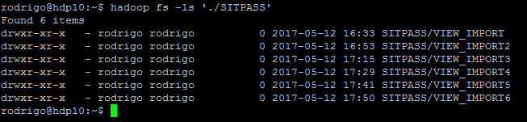
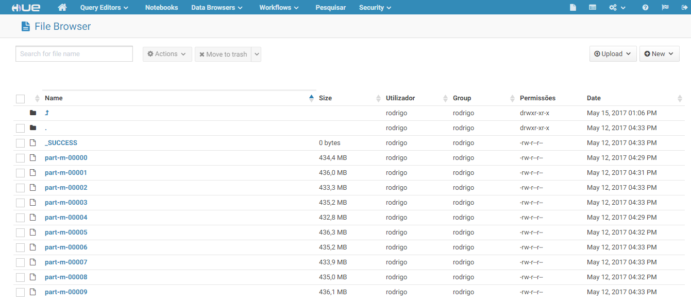

# Importação de Dados para o Sqoop:

Tentativa de um import direto, salvando no HDFS diretamente num arquivo de texto através do comando abaixo:  
```bash
sqoop import --connect jdbc:oracle:thin:<dados_de_acesso> --username <user>  -P --table SIM_DETALHE_INFORMACAO --m 1 --target-dir -- /user/rodrigo/<dir_> --verbose >> log.txt
```
> Neste caso, como não havia uma _primary key_ na tabela-origem, não era possível setar o número de mappers para maior do que 1. Deixei rodando por cerca de 50 minutos e não tive nenhum resultado. Observe que a velocidade foi baixíssima: (0,112 Mbytes/seg);

Na segunda tentativa eu criei uma tabela menor na base do Oracle apenas para teste:

```sql
Create table teste as select * from SIM_DETALHE_INFORMACAO where ROWNUM < 10
```
Tive o erro: ___ERROR manager.SqlManager: Error executing statement: java.sql.SQLRecoverableException: Exceção de E/S: Connection reset___.  

Resolvi através do comando direto no terminal Linux:
```bash
export HADOOP_OPTS=-Djava.security.egd=file:/dev/../dev/urandom
```
Referências: [Pythian](https://www.pythian.com/blog/connection-resets-when-importing-from-oracle-with-sqoop/) e [StackOverFlow](http://stackoverflow.com/questions/2327220/oracle-jdbc-intermittent-connection-issue) com a explicação dos porquês.

Tornou-se evidente que era necessário dividir a tarefa para aproveitar o processamento do cluster Hadoop. Após dar uma olhada nos dados da tabela (58 colunas), selecionei duas opções para dividir os dados.  

```bash
sqoop import --connect jdbc:oracle:thin:<dados_de_acesso> --username <user> -P --table SITPASS.SIM_DETALHE_INFORMACAO --split-by CD_OPERADORA --where 'NR_LINHA=887' --target-dir  /user/rodrigo/<dir_>2>&1|tee log4.txt
```
>Um método eficaz se não tivesse que executar esse comando para cada condicional WHERE, logo, criando um diretório para cada um deles. No caso eram 290, tornando, _a priori_, um processo não tão recomendável pelo numero de diretórios. Depois seria útil para particionar a tabela em questão. Cerca de 1GB de dados a cada 160 segundos para 5% da tabela.

Finalmente, criei uma View da tabela no Oracle:
```sql
CREATE OR REPLACE VIEW VW_SIM_DETALHE_INFORMACAO AS
SELECT ROWNUM AS NUM_LINHA, DI.* FROM SIM_DETALHE_INFORMACAO DI;
```
criando uma PK com o num_linha, utilizando as tags `--split-by NUM_LINHA` e `--where 'NUM_LINHA<10000000'`, criando apenas 6 diretórios. Cada conjunto de 10 MI linhas demorou cerca de dez para executar, beirando os 8 MBytes/segundo.

  

Cada bloco de dados está organizado da seguinte forma:


>Exibição através do HUE.
